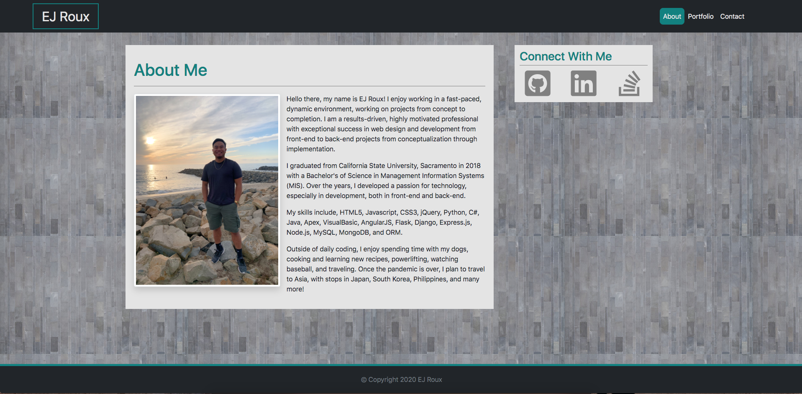
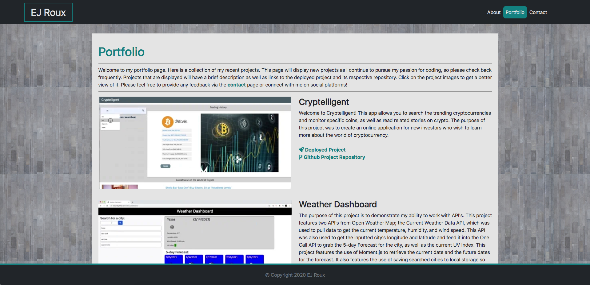
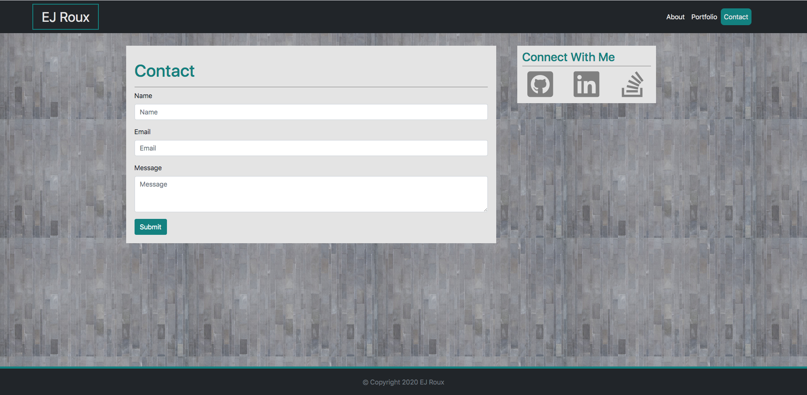

# Responsive Portfolio

## Description

The purpose of this project is to demonstrate my ability to use the most recent version of [Bootstrap](https://getbootstrap.com/) to build responsive web pages. The project contains 3 different pages, an "About Me" page, a "Portfolio" page, and a "Contact" page. This project will also be my own personal portfolio that will showcase many future projects that I will build! 

Deployed Project: https://eroux13.github.io

## About Me

This is the home page that gives a brief description of who I am, my skills, and my hobbies. I have also included icons, which when clicked on, will link to my professional socials. 

## Portfolio

This is the portfolio page which will showcase all of my current and future projects! Links to the deployed project and its respective repo will be listed on this page as well. Clicking on the project image/gif will open it in a new tab with the whole image or a preview of the project on [giphy](https://giphy.com/channel/whatupeeeej).

## Contact

This is the contact page. When the submit button is clicked, it will open the default mail client on the OS which will then have a populated subject line, message body, and recipient email address.

