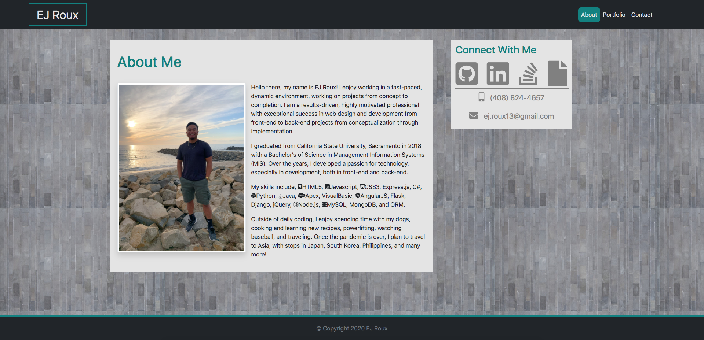
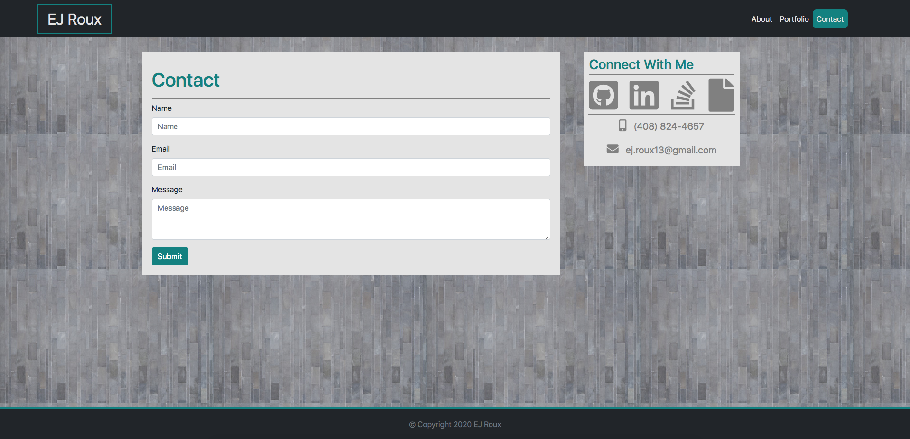

# Responsive Portfolio

## Description

The purpose of this project is to demonstrate my ability to use the most recent version of [Bootstrap](https://getbootstrap.com/) to build responsive web pages. The project contains 3 different pages, an "About Me" page, a "Portfolio" page, and a "Contact" page. This project will also be my own personal portfolio that will showcase many future projects that I will build! 

Deployed Project: https://eroux13.github.io

## About Me

This is the home page that gives a brief description of who I am, my skills, and my hobbies. I have also included icons, which when clicked on, will link to my professional socials. 

## Portfoloio

This is the portfolio page which will showcase all of my future projects!

## Contact

This is the contact page which has a form that is still under development.

